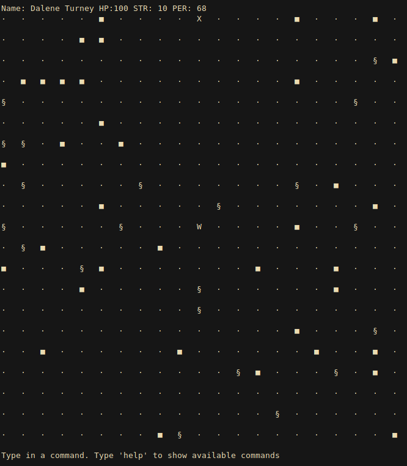

# TextAdventure (Modulopgave 4)

 This work is licensed under a <a rel="license" href="http://creativecommons.org/licenses/by-nc-sa/4.0/">Creative Commons Attribution-NonCommercial-ShareAlike 4.0 International License</a>.

**Introduction:**

<pre>
Winter in The New World...
The deathly chill clings to everything it touches, banshee howls of wind blows across the rooftops. 
Hail falling like meteors large enough to break a skull open, breaking the few remaining windows left in the townscape.
You and your scavenger group have taken shelter from the harsh nuclear winter storms in a building. 
The building is located in what seems to be the last still standing town you have found across journey through the wasteland.
Your group was recently set upon by the radioactive dead, zombies and ghouls that roam the barren lands... 
You and The Doc were the only ones, who managed to sustain no damage. You took upon this journey with your group to find useful scrap. 
With the winters being harsh as they are, most creatures lay low in the winter, which gives grave opportunities to scour the land for resources.
</pre>

## Programming stuff / Notes to ourselves

### Main game elements

- A World contains Buildings and Persons (otherwise wilderness), Buildings contain Rooms and Rooms contain Persons, Items and GameObjects.
- Items can be Potions. Could be expanded with Weapons, Armor etc
- Players can run Commands.
- Persons can Talk (Text)
- Positioning of fx. Players and Items are tracked by the Players and Items themselves, not by the World or Rooms (unlike earlier versions).

Speaking is done with something like this:  
speak(file, 132)  
...and it prints whatever is on line 132 in that file, and it also checks the language configured in Game.java automatically.

#### Buildings

- always entered from the bottom
- rooms are laid out on x/y axes. the first room is always 0,0
- the y-axis' minimum is always 0 (the first room) but can be up to any positive number.
- the x-axis is an interval from any negative to any positive value.
- moving north increments the y-axis, and south decrements it.
- moving east increments the x-axis, and west decrements it.
- Consequently each Room's position consists of two numbers: one for each axis.
- A Building contains only a maximum value of y, and a minimum AND maximum value of x.

### TODO ideas

- Support movement keys? Successfully tested, but it would require JNA. Type in "keys" in command to activate them, and q or x to exit?
- More ASCII art, maybe even animations requiring you to type enter between each? Maybe use VLC ascii or ffmpeg to get frames out at some frame rate and jp2a mass convert them?
- Maybe represent enemy classes/types differently on the map. Could also be somewhat messy/confusing, though?

#### Items

Drop/spawn rates?

### Options

- Set world size
- Set language
